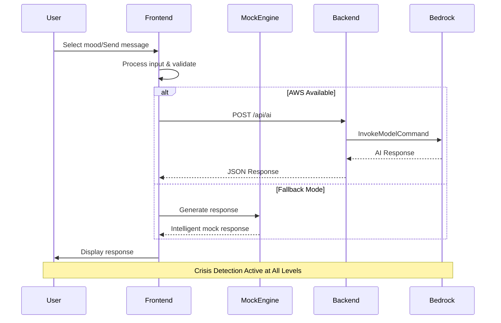
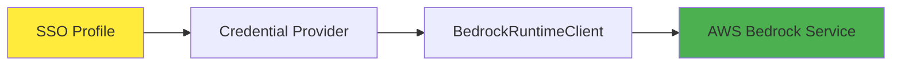
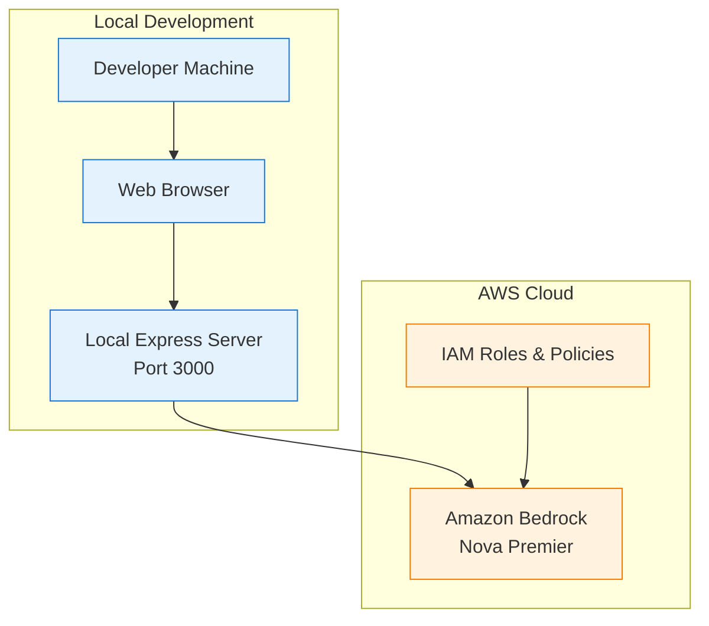

# MindSpace Mental Health Bot - System Architecture

## Overview
MindSpace is a mental health companion application that provides AI-powered conversational support with mood tracking, voice interaction, and crisis detection capabilities.

## System Architecture Diagram

```mermaid
graph TB
    %% User Interface Layer
    subgraph "Frontend (Client-Side)"
        UI[🌐 Web Interface<br/>index.html]
        CSS[🎨 Styling<br/>styles.css]
        
        subgraph "JavaScript Components"
            APP[📱 Main App<br/>app.js<br/>MentalHealthBot Class]
            MOCK[🤖 Mock Responses<br/>mock-responses.js<br/>Intelligent Fallback]
            AWS_CONFIG[⚙️ AWS Configuration<br/>aws-config.js<br/>Bedrock Integration]
        end
        
        subgraph "Browser APIs"
            SPEECH[🎤 Speech Recognition<br/>Web Speech API]
            AUDIO[🔊 Audio Output<br/>Text-to-Speech]
        end
    end

    %% Backend Layer
    subgraph "Backend Services"
        SERVER[🖥️ Express Server<br/>server.js<br/>Port 3000]
        
        subgraph "Dependencies"
            EXPRESS[Express.js<br/>Web Framework]
            CORS[CORS<br/>Cross-Origin Support]
        end
    end

    %% AWS Cloud Services
    subgraph "AWS Cloud Infrastructure"
        BEDROCK[🧠 Amazon Bedrock<br/>Nova Premier Model<br/>AI Response Generation]
        
        subgraph "AWS SDK"
            BEDROCK_CLIENT[BedrockRuntimeClient<br/>@aws-sdk/client-bedrock-runtime]
            CREDS[Credential Providers<br/>@aws-sdk/credential-providers<br/>SSO Authentication]
        end
    end

    %% Data Flow Connections
    UI --> APP
    CSS --> UI
    APP --> MOCK
    APP --> AWS_CONFIG
    APP --> SPEECH
    APP --> AUDIO
    
    APP -->|HTTP POST /api/ai| SERVER
    SERVER --> BEDROCK_CLIENT
    BEDROCK_CLIENT --> CREDS
    BEDROCK_CLIENT --> BEDROCK
    
    SERVER --> EXPRESS
    SERVER --> CORS
    
    BEDROCK -->|AI Response| SERVER
    SERVER -->|JSON Response| APP
    
    %% Fallback Flow
    APP -.->|Fallback Mode| MOCK
    
    %% Styling
    classDef frontend fill:#e1f5fe,stroke:#01579b,stroke-width:2px
    classDef backend fill:#f3e5f5,stroke:#4a148c,stroke-width:2px
    classDef aws fill:#fff3e0,stroke:#e65100,stroke-width:2px
    classDef api fill:#e8f5e8,stroke:#1b5e20,stroke-width:2px
    
    class UI,CSS,APP,MOCK,AWS_CONFIG,SPEECH,AUDIO frontend
    class SERVER,EXPRESS,CORS backend
    class BEDROCK,BEDROCK_CLIENT,CREDS aws
```

## Component Details

### Frontend Components

#### 1. **MentalHealthBot Class (app.js)**
- **Core Features:**
  - Mood selection and tracking
  - Chat message management
  - Voice input/output handling
  - Session management
  - Connection status monitoring

- **Key Methods:**
  - `initializeEventListeners()` - UI event handling
  - `initializeSpeechRecognition()` - Voice input setup
  - `sendMessage()` - Message processing
  - `getAWSResponse()` - AI service integration
  - `generateMockResponse()` - Fallback responses

#### 2. **MockResponses Class (mock-responses.js)**
- **Intelligent Fallback System:**
  - Pattern-based response matching
  - Crisis detection and intervention
  - Mood-influenced responses
  - Context-aware conversations
  - Therapeutic techniques integration

- **Response Categories:**
  - Stress and overwhelm
  - Anxiety and worry
  - Depression and sadness
  - Sleep issues
  - Relationship problems
  - Work/career stress
  - Self-care guidance

#### 3. **AWS Integration (aws-config.js)**
- **AWSIntegration Class:**
  - Bedrock client initialization
  - Health checks and error handling
  - Credential management
  - Retry logic with exponential backoff

### Backend Services

#### 4. **Express Server (server.js)**
- **API Endpoints:**
  - `POST /api/ai` - AI response generation
- **Features:**
  - CORS enabled for cross-origin requests
  - JSON request/response handling
  - AWS Bedrock Nova Premier integration
  - Error handling and fallback responses

### AWS Cloud Services

#### 5. **Amazon Bedrock Nova Premier**
- **AI Model Configuration:**
  - Model ID: `arn:aws:bedrock:us-east-1:569034624657:inference-profile/us.amazon.nova-premier-v1:0`
  - Region: `us-east-1`
  - Authentication: SSO profile-based

## Data Flow Architecture



## Security & Authentication

### AWS Authentication Flow


## Key Features

### 🎯 **Core Capabilities**
- **AI-Powered Conversations**: Amazon Bedrock Nova Premier integration
- **Mood Tracking**: Visual mood selection with contextual responses
- **Voice Interaction**: Speech-to-text and text-to-speech capabilities
- **Crisis Detection**: Automatic identification and appropriate resource provision
- **Intelligent Fallbacks**: Sophisticated mock response system when AWS unavailable

### 🛡️ **Safety Features**
- Crisis keyword detection
- Emergency resource provision
- Professional help recommendations
- Therapeutic technique integration

### 🔧 **Technical Features**
- Responsive web design
- Real-time connection status
- Session management
- Error handling and recovery
- Cross-browser compatibility

## Deployment Architecture



## Technology Stack

| Layer | Technology | Purpose |
|-------|------------|---------|
| **Frontend** | HTML5, CSS3, Vanilla JavaScript | User interface and interaction |
| **Backend** | Node.js, Express.js | API server and request handling |
| **AI Service** | Amazon Bedrock Nova Premier | Natural language processing |
| **Authentication** | AWS SSO | Secure cloud service access |
| **Browser APIs** | Web Speech API | Voice input/output |
| **Styling** | CSS Grid, Flexbox, Animations | Responsive design |

## Configuration Files

- **package.json**: Node.js dependencies and scripts
- **aws-config.js**: AWS service configuration and credentials
- **styles.css**: Complete UI styling with responsive design
- **index.html**: Main application structure and fallback scripts

This architecture provides a robust, scalable mental health support application with intelligent fallbacks, comprehensive safety features, and seamless AWS cloud integration.